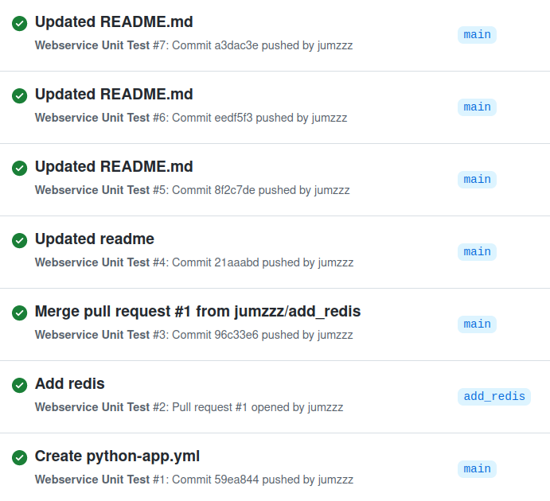

# Serving Models 
  
This serves as a reference and a demo on how to serve models with
LightGBM, Flask, gunicorn, nginx, and redis

The task is to create a Web Service that serves a model that predicts the Income Bracket using **Adult Census Dataset**

## Training Details

Model Training is implemented at `training` folder. 

## Implemented Stuff
- Web Service that uses `Flask`, `gunicorn`, and `nginx` :heavy_check_mark:
- Uses `redis` for caching :heavy_check_mark:
- `POST` driven endpoint :heavy_check_mark:
- Model Feature Engineering :heavy_check_mark:
- Hyperparameter Tuning (LGBM w/ Bayesian Optimization) :heavy_check_mark:
- docker + docker-compose :heavy_check_mark:
- Unit Testing + Github Actions :heavy_check_mark:

## Not Included
- API accessible from a remote server :heavy_multiplication_x:
- Load-testing the service can handle 100 concurrent users :heavy_multiplication_x:


## How to Run the WebService Locally

The simplest way to run the Web Server is to use `docker-compose`. In this exact location of this repository simply type:

```
docker-compose up -d --build
```

Where it spins-up three Docker Containers. Namely:
- Container for `Flask` and `gunicorn`
- Container for `nginx`
- Container for `redis`


You can use the following endpoint locally

```
http://0.0.0.0:1337/predict_income
```

Where it takes a sample payload from a `POST` request


### Sample Payload
For more details, go to `sample_payload` directory. You'll find a sample file, and a sample script to execute.

```
{'age': 82,
 'workclass': 'Private',
 'fnlwgt': 132870,
 'education': 'HS-grad',
 'marital.status': 'Widowed',
 'occupation': 'Exec-managerial',
 'relationship': 'Not-in-family',
 'race': 'White',
 'sex': 'Female',
 'capital.gain': 0,
 'capital.loss': 4356,
 'hours.per.week': 18,
 'native.country': 'United-States'}
```

And receives an output 

### Sample Output using the Previous Payload
```
{'predicted_income_class': '<=50k', 'prediction_raw': 0.08823289115946195, 'status': 'success'}

```

## Github Actions - Auto-trigger of Unit Testing
Unit Test is triggered on **push** and **pull-request** events


